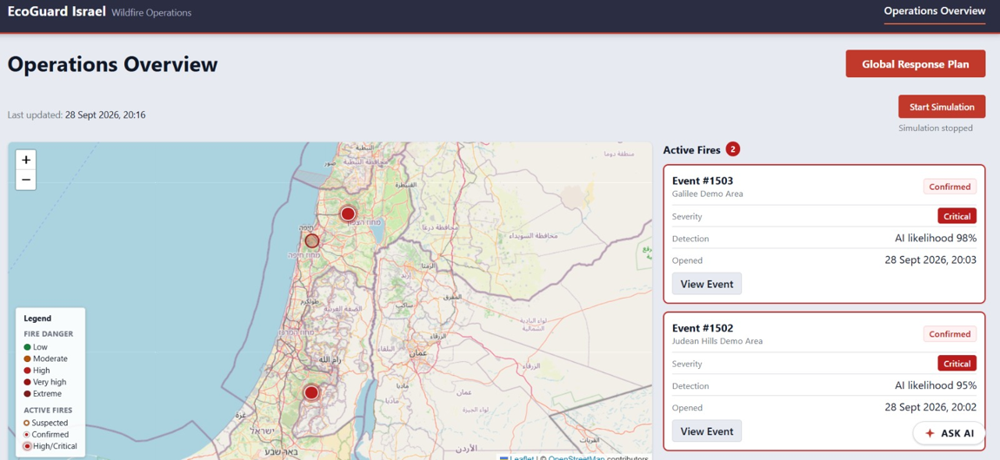
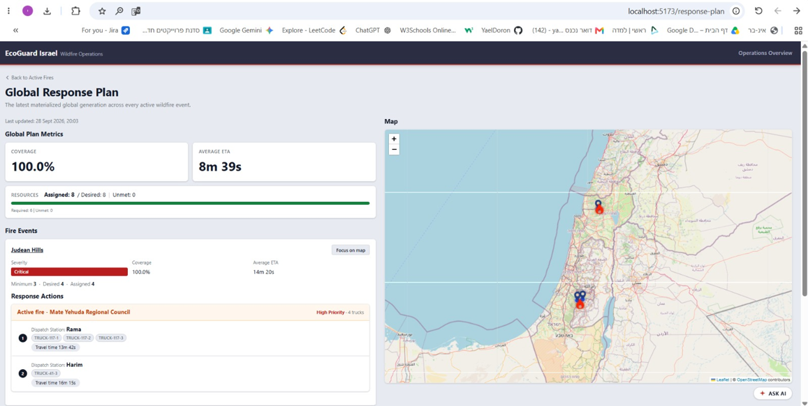
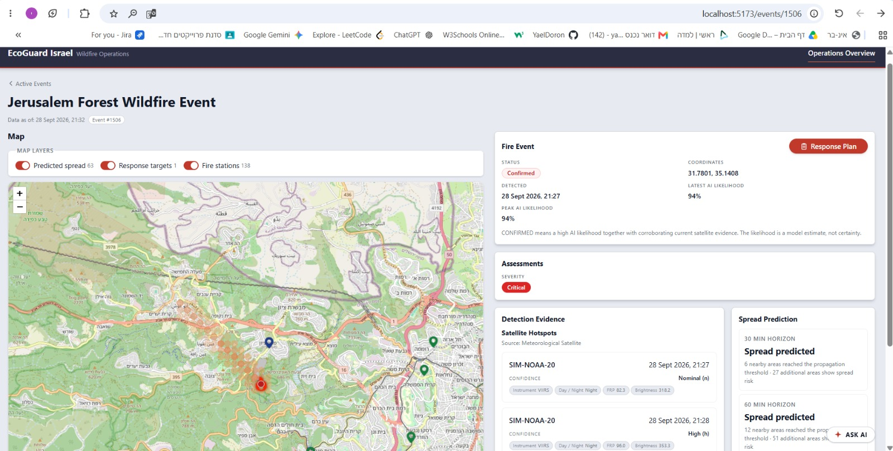
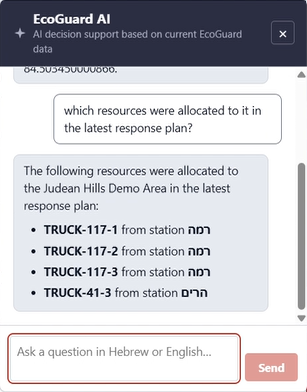
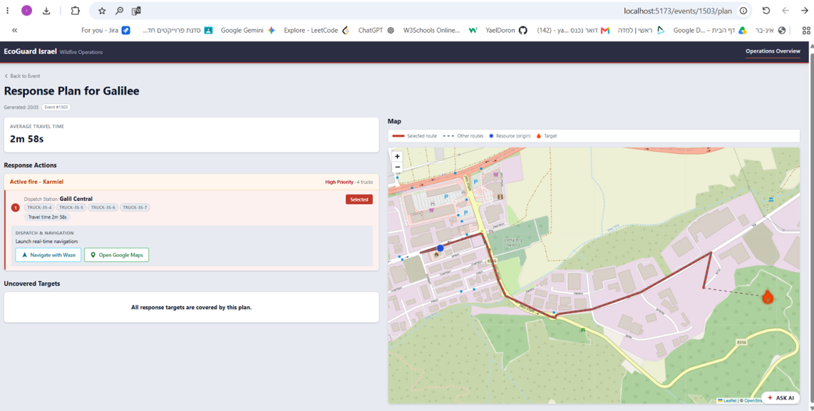

# EcoGuard Israel

EcoGuard Israel is a wildfire detection and response-planning system for Israel. It combines satellite hotspots (NASA FIRMS), weather data (IMS), news reports and land-cover data (Copernicus) to detect fires, assess severity, predict spread, and generate response plans. Results are shown in a React dashboard.

<div align="center">
  
</div>


- **Backend:** Python 3.12, FastAPI, SQLAlchemy, PostgreSQL (Neon) — `backend/`
- **Frontend:** React + TypeScript + Vite — `frontend/`

---

## Getting Started

### 1. Configure environment variables

Copy the example files and fill in your own values. Never commit real `.env` files.

```bash
# From the repository root (read by the backend)
cp .env.example .env
```

### 2. Set up the Python backend

From `backend/`, create and activate the virtual environment, then install dependencies:

```bash
cd backend
python -m venv venv
```

Activate it:

```bash
# Windows (PowerShell)
.\venv\Scripts\Activate.ps1

# Windows (cmd)
venv\Scripts\activate.bat

# macOS / Linux
source venv/bin/activate
```

Install dependencies:

```bash
pip install -r requirements.txt
```

### 3. Run the backend server

From `backend/`, with the venv active:

```bash
python -m uvicorn src.api.app:app --reload
```

The API is served at `http://localhost:8000`. Interactive API docs (Swagger UI) are at `http://localhost:8000/docs`.

Quick check:

```text
GET http://localhost:8000/health
```

```json
{"status": "ok"}
```

### 4. Run the backend tests

From `backend/`, with the venv active:

```bash
# Full suite (integration tests need a live Neon/PostgreSQL database via DATABASE_URL)
pytest

# Unit tests only, no database required
pytest -m "not integration"
```

### 5. Set up and run the frontend

In a second terminal:

```bash
cd frontend
npm install
npm run dev
```

The dashboard opens at `http://localhost:5173`.

Other frontend commands:

```bash
npm run build   # type-check and production build
npm test        # run tests once (Vitest)
npm run lint    # lint (oxlint)
```
---

## Frontend Overview

The dashboard includes:

- **Active Wildfires** (`/events`): list and map of currently active (suspected/confirmed) fires
- **Event Details** (`/events/:fireEventId`): detection, severity and spread for a single fire
- **Response Plan** (`/events/:fireEventId/plan`, `/plans/:planId`): the response plan for one fire
- **Global Response Plan** (`/response-plan`): a combined plan across all confirmed fires
- **Simulation controls**: start and stop the demo simulation

<br>
<table align="center">
  <tr>
    <td colspan="2" align="center">
      <br>
      <b>Global Response Plan</b>
    </td>
  </tr>
  <tr>
    <td colspan="2" align="center">
      <br>
      <b>Event Details</b>
    </td>
  </tr>
  <tr>
    <td align="center" valign="bottom">
      <br>
      <b>EcoGuard AI Chatbot</b>
    </td>
    <td align="center" valign="bottom">
      <br>
      <b>Event Response Plan</b>
    </td>
  </tr>
</table>

---

## Demo Simulation and Presentation Mode

> Requires `ENABLE_DEMO_DATA_RESET=true` and `ENABLE_SIMULATION_CONTROL_API=true` in `.env`.

The dashboard has one simulation control:

- **Start Simulation** appears when no run is active, including after a run has completed or been stopped. It runs the `presentation_demo` preset: a mandatory demo-state reset, then a fixed, paced 30-minute timeline.
- **Stop Simulation** appears while a run is active. Clicking it takes effect immediately: the run becomes `stopping` and the button shows "Stopping...". No new scheduled event starts. The event already in progress finishes as one unit (evidence → detection → severity → spread → targets → routing → allocation → plans), so a CONFIRMED fire never loses its downstream outputs. The run then becomes `stopped`. All generated data stays available to inspect; nothing is deleted until the next start resets the demo state.

### Response plan lifecycle

Response plans are generated asynchronously after a fire is CONFIRMED. The plan pages show a status based on the stored data:

- **"Generating response plan..."**: a confirmed fire has no plan yet.
- **"Updating response plan... Currently covers X of Y confirmed fires"**: the shown plan doesn't yet include every confirmed fire.
- **"No response plan available"**: shown only when no fire is confirmed.

Only CONFIRMED (response-eligible) fires are counted. SUSPECTED fires are monitoring-only and are listed as such, never as pending.

While a run is live, the Global Response Plan refreshes every 5 seconds in every state, so an open page picks up newly confirmed fires. While a new run is still starting up, it shows nothing from the previous run. After the run ends, it keeps refreshing only while a plan is still being completed, for at most about 1 minute.

